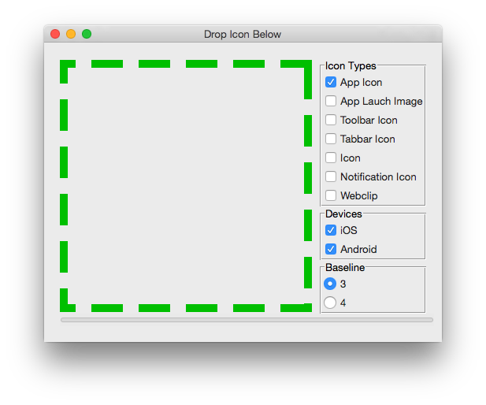
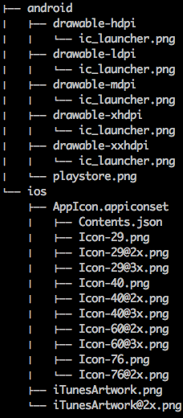

# Icons

generate icons of all sizes and config file (e.g. Contents.json) required by iOS or Android app, inspired by http://makeappicon.com

# Supported Devices

* iOS
* Android
* Windows Phone
* OS X: iconset && icns(only mac)
* Windows: ico
* Blackberry
* Chrome Web Store

## Destop version



### Download

* [1.1](https://github.com/exherb/icons/releases/tag/1.1)

## Web version

[iconographys](http://iconographys.appspot.com/) - http://iconographys.appspot.com/

## CLI version

### install

just type `pip install icons` in your term.

### usage

```bash
icons [-o TARGET_PATH] [--baseline BASELINE]
      [--type {launch,notification,image,tab,webclip,toolbar,icon}]
      [--devices {ios,android} [{ios,android} ...]] [--zip]
      icon_path
```

* icon_path - the source image path
* target_path(optional) - the target path
* baseline(optional) - baseline scale. the default is 3, and it's mean the source image is at @3x scale
* type(optional) - icon type, the default is icon
* devices(optional) - including only devices
* --zip(optional) - put icons into a zip file instead of directory


